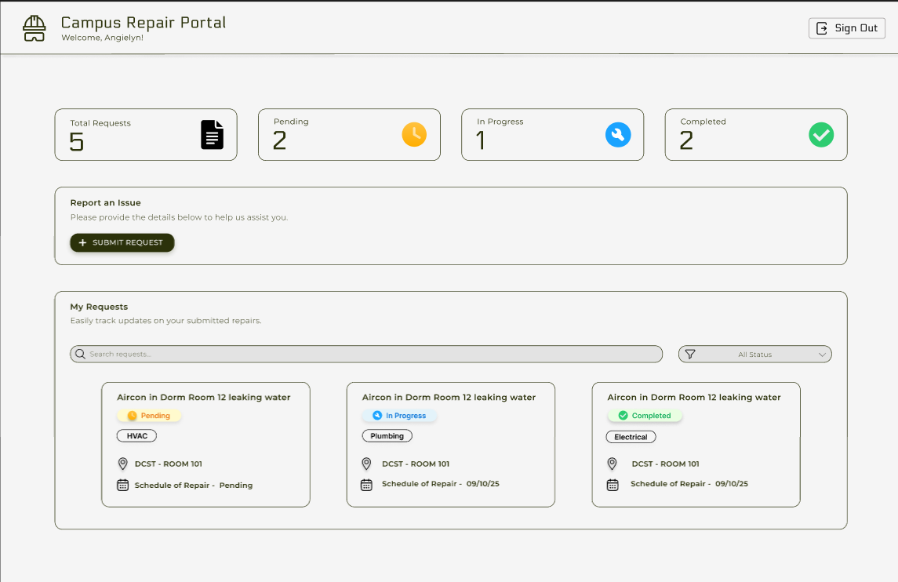

## White Cloud  
**Target:** AB.010.001

---
#### Site Map
[Project Homepage](project-homepage.md) > **Online Request Submission**

---

### FR 1.0 - Online Request Submission

Allow requesters to submit repair/service request online through the website

---

#### Mockup/Wireframe

The dashboard shows:
- Total requests overview with status counts
- Quick access to submit new requests
- Request tracking interface with search and filter capabilities
- Real-time status indicators (Pending, In Progress, Completed)

---

###   Use Case: Submit Repair Request
Allows a requester to submit a new service or repair request

#### Actors
- Requester

#### Preconditions
- Must be logged in into the system

#### Postconditions
- A new request is recorded in the system, awaiting review by the clerk

---

#### Basic Flows

| Actor Action | System Response |
|-------------|-----------------|
| 1. Requester selects "Submit Request." | 1.1 Displays request submission form. |
| 2. Requester fills out form and clicks "Submit." | 2.1 Validates the data and records the request in the database. Confirmation is displayed. |

---

#### Sub-Use Cases

#### 1. [Submit Form](submit-repair-request-submit-form.md)
The requester fills out and submits the repair request form.

#### 2. [Upload Photos](submit-repair-request-upload-photos.md)
The requester uploads photo attachments for the repair request.

#### 3. [Validate Request](submit-repair-request-validate-request.md)
System checks whether the entered data is complete and valid.

---

© 2026 TRAQ
